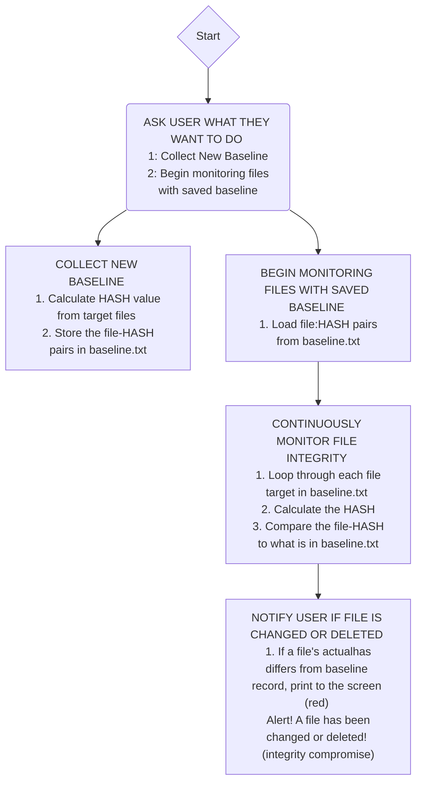

# File-Integrity-Monitor

```mermaid
flowchart TD;
    A{Start} --> B(ASK USER WHAT THEY WANT TO DO <br> 1: Collect New Baseline <br> 2: Begin monitoring files with saved baseline)
    B --> C[COLLECT NEW BASELINE <BR> 1. Calculate HASH value from target files <br> 2. Store the file-HASH pairs in baseline.txt]
    B --> D[BEGIN MONITORING FILES WITH SAVED BASELINE <br> 1. Load file:HASH pairs from baseline.txt]  
D-->E[CONTINUOUSLY MONITOR FILE INTEGRITY <br> 1. Loop through each file target in baseline.txt <br> 2. Calculate the HASH <br> 3. Compare the file-HASH to what is in baseline.txt]
E-->F["NOTIFY USER IF FILE IS CHANGED OR DELETED <br> 1. If a file's actualhas differs from baseline record, print to the screen (red) <br> Alert! A file has been changed or deleted! (integrity compromise)"]
```
